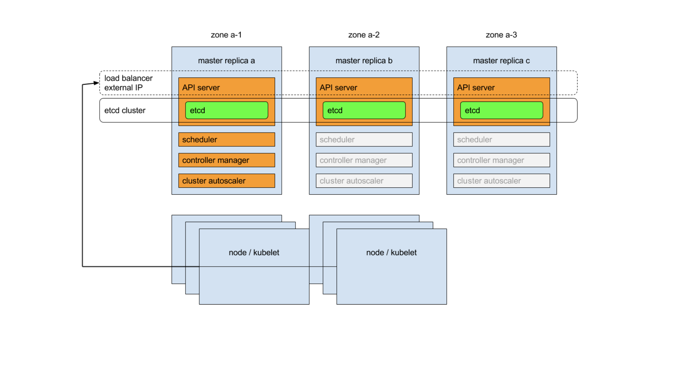

# 1.  git clone practice
```bash
## master-1에서 실행
## root 로 진행 

cd practice/lec0/multi-master

```
# 2. multi master rke2




## 2.1 master01 설치
1. lightsail에서 master1~3 개 vm 생성 한다 
```bash
## root로 로그인
sudu su -

git clone https://github.com/io203/edu-k8s-internal.git


export EXTERNAL_IP={server-ip}
sh rke2-master01-install.sh

source ~/.bashrc

## debug
journalctl -u rke2-server -f

kubectl version
kubectl config view 
kubectl cluster-info
kubectl get nodes
kubectl get pod -A -o wide
```

## 참고: uninstall rke2
```sh
rke2-uninstall.sh
```

## 2.2 k9s 설치 
```bash
# install k9s with snap
snap install k9s 
ln -s /snap/k9s/current/bin/k9s /snap/bin/
```

## 2.3 master01 token  
master01에서 
```
cat /var/lib/rancher/rke2/server/node-token

K1036e5d23529ef532f73a7e02d8f2a0d5fe34853b045d81943545f8880929fa553::server:f6b59a8608679de2c3f79b1dcd9ab8351234

```

## 2.4 master02 설치 
```bash
## master-1이 어느정도 설치가 끝나고 진행 한다 
## root로 로그인 
sudo su -

git clone https://github.com/io203/edu-k8s-internal.git


export EXTERNAL_IP=52.78.102.99
export MASTER01_INTERNAL_IP=172.26.14.37

sh rke2-master02-03-install.sh

```

## 2.5 master03 설치 
```bash
## root로 로그인 
export EXTERNAL_IP=13.209.14.126
export MASTER01_INTERNAL_IP=172.26.14.37
sh rke2-master02-03-install.sh
```

## 2.6 worker(agent)
```sh 
### agent-1
export MASTER01_INTERNAL_IP=172.26.14.37
sh rke2-agent-install.sh

### agent-2
export MASTER01_INTERNAL_IP=172.26.14.37
sh rke2-agent-install.sh
```

## 2.7 ubuntu 유저에서 kubeconfig 설정 
### ubuntu 유저
```sh
sh master-ubuntu-user-kubeconfig.sh
```